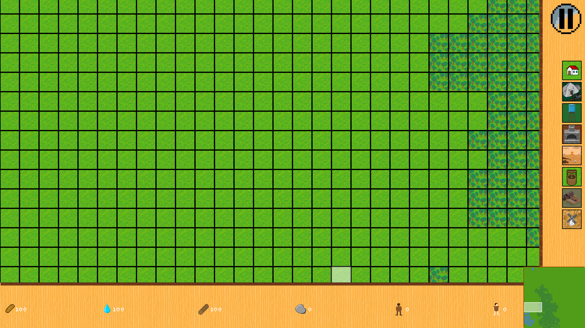

# Promised Land
## Описание
Promised land - игра в жанре стратегия. 
Стойте своё поселение, обеспечивайте его ресурсами и соберите как можно большее население!

## Игровые механики
В игре перед вами предстаёт случайно сгенерированное поле 100x100 клеток.

В нижней части экрана отображается количество доступных ресурсов. Ресурсы зарабатываются с помощью зданий, о них речь пойдёт позже.

* __Еда__. Очень важный ресурс. Если его количество опуститься ниже единицы - население считается голодающим и игра заканчивается. Добывается с помощью клеток мельницы и печи.
* __Вода__. Очень важный ресурс Если его количество опуститься ниже единицы - население считается страдающим от жажды и игра заканчивается. Добывается с помощью клеток колодца и водонапорной вышки.
* __Дерево__. Используется для строительства. Добывается с помощью лесопилки.
* __Камень__. Используется для строительства. Добывается с помощью шахты. 
* Основным ресурсом и показателем прогресса является __население__. Чем его больше, тем успешнее ваше поселение. Население может увеличится благодаря клетке дома (см. ниже). Предпоследний индикатор отображает общее количество людей, последний индикатор - количество людей, не занятых в производстве. При появлении люди автоматически распределяются по свободным местам на доступных производящих зданиях

Справа находится меню строительства. Там представлены здания, которые можно разместить на клетках поля. Все здания можно размещать на клетках всех типов, кроме воды, островов и леса, если не упомянуто обратного.
* __Дом__ . Требует 15 единиц дерева для строительства. Приносит 5 населения после появления. В течении игры количество людей в доме может как увеличиваться, так и уменьшаться
* __Шахта__. Требует 15 единиц дерева для строительства. Каждый тик приносит 5 единиц камня за одного работника
* __Водонапорная станция__. Требует 30 единиц камня для строительства. Каждый тик приносит 25 единиц воды за одного работника
* __Печь__. Требует 30 единиц камня для строительства. Каждый тик приносит 25 единиц камня за одного работника
* __Пустошь__. Не требует ничего для строительства. Ничего не приносит. Можно разместить на клетке любого типа
* __Колодец__. Требует 10 единиц дерева для строительства. Каждый тик приносит 10 единиц воды за одного работника
* __Лесопилка__. Требует 10 дерева для строительства. Каждый тик приносит 5 единиц дерева за одного работника
* __Мельница__. Требует 10 единиц дерева для строительства. Каждый тик приносит 10 единиц камня за одного работника

В производящих зданиях(шахта, водонапорная станция, печь, колодец, лесопилка, мельница) необходимы люди чтобы работать. Чем больше работников, тем больше ресурсов приносит здание. В левом верхнем углу клетки можно увидеть сколько людей работает в здании, и сколько работников может быть максимально.

Справа внизу расположена миникарта, а в правом верхнем углу кнопка паузы.

## Как играть?
Проект разработан для Linux с использованием графической библиотеки SFML.

Для сборки проекта выполните команду
```
make
```
Исполняемый файл будет помещён в папку Bin, объектные файлы появятся я в папке Obj.

Для запуска выполните команду
```
make run
```
Или запустите исполняемый файл Bin/run.

## Для разработчиков
Про реализацию проекта и его исходных код можно прочитать в [этом файле](Src/README.md). 

## Release history

### Alpha 5.0
#### In game
* Add top population games
* Add minimap
* Add new cell: WaterTower - water generator
* Add new cell: Oven - food generator
* fix bugs


### Alpha 4.0
#### In game
* Update menu
* Add pause
* Add notifications
* Fix bug: after loading map no resources saves
* Update view
* Map bigger than screen


### Alpha 3.0
#### In game
* Add indicators of people work/live in buildings
* Add menu
* Add new resource: stone
* Add new cell: mine
* People in houses can born and die
### In code
* Add script language to save and generate map (see examples in folder Scripts)
* Add all cells like plugins 

### Alpha 2.0
#### In game
* Wold generation
* Add limitation for building place for every buildings
* Add icons on resource bar
* Producer building(windmill, well, sawmill) now need people to work. More people - more efficiency


