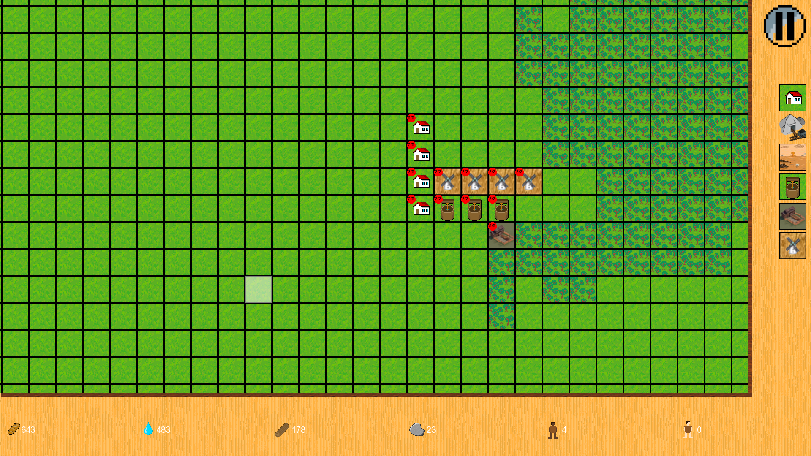
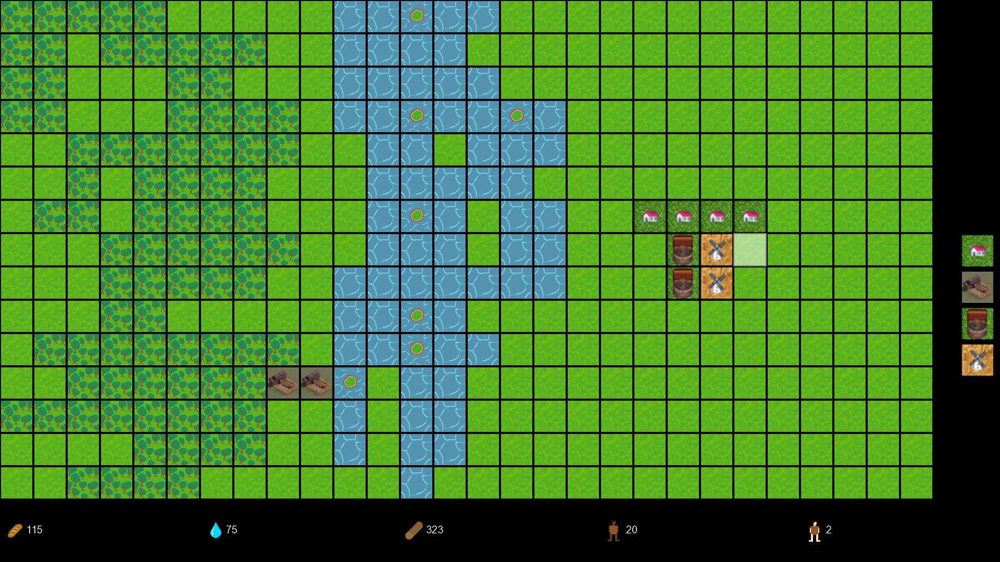

# Alpha 4.0
## In game
* Update menu
* Add pause
* Add notifications
* Fix bug: after loading map no resources saves
* Update view
* Map bigger than screen

# Alpha 3.0
## In game
* Add indicators of people work/live in buildings
* Add menu
* Add new resource: stone
* Add new cell: mine
* People in houses can born and die
## In code
* Add script language to save and generate map (see examples in folder Scripts)
* Add all cells like plugins 

# Alpha 2.0
## What new
* Wold generation
* Add limitation for building place for every buildings
* Add icons on resource bar
* Producer building(windmill, well, sawmill) now need people to work. More people - more efficiency

